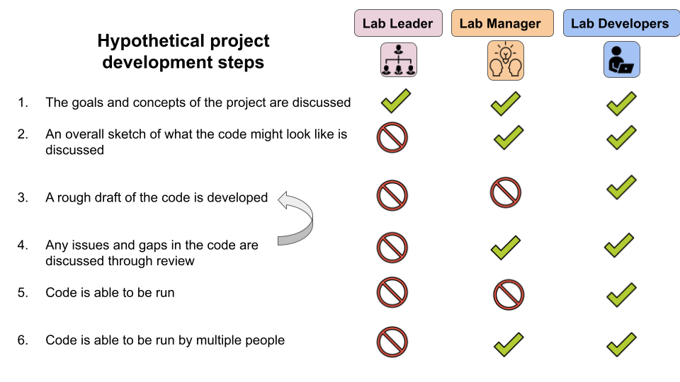
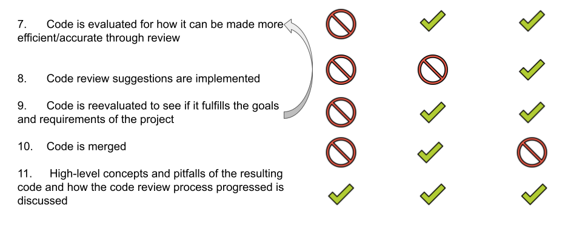

Creating quality code is tricky, whether it be for data analysis or a software package or some other context. If your lab creates code, we using a system of code review, which we will give you resources here to help you get that set up.

Code review does take more time upfront than not doing code review, but the long-term benefits of code review are worth the upfront costs. Code review will not make your code perfect, but it will help to make your code _less wrong_.

## Benefits of code review:  

- More efficient code!
- More readable code!
- More reproducible code!
- Less wrong code!
- Both the people who write the code originally and review the code will learn more by doing code review!
- More transparency around the inner workings of the code of a project.

## More reading:  

- [Opinionated analysis development](https://doi.org/10.7287/peerj.preprints.3210v1) by Hilary Parker
- [Why code reviews matter (and actually save time!)](https://www.atlassian.com/agile/software-development/code-reviews) by Dan Radigan.
- [Why code reviews make better code teams](https://simpleprogrammer.com/why-code-reviews-make-better-code-teams/) by Herbert Bodner.

Code review works best when the whole lab is committed to the process. Your lab can use the resources here and discuss how you'd like to set up a code review system.
Throughout this process of code review and especially when setting up a new method in your lab, **communication is critical**. Everyone in the lab should err on the side of over-communication!

## Lab roles

Depending on your role in your lab, there are different resources we recommend. We've defined three different kinds of roles for the purposes of these resources and discussion.

Note that these are not formal titles, but more general descriptions of responsibilities members of a lab might have. We've created them to help with our general discussion about lab dynamics and how code review might take place most effectively and efficiently in your lab.

-  [**Lab Leader**](#resources-for-lab-leaders) - Oversees a lab with people who write code
-  [**Lab Manager**](#resources-for-lab-managers) - Mentors people who are write code but also sometimes writes code themselves
-  [**Lab Developer**](#resources-for-lab-developers) - Writes code

### Overview of what project development

This is a very hypothetical overview of what project development may look like. In reality, project development doesn't take the form of perfect linear steps that lead nicely from one to the other.

A lot of your team's own project development will be something you all need to learn and determine what works best as a group. This is to say that **communication that is loaded with empathy is of the utmost importance throughout this process from all parties**.

From here, we recommend you go to the page that most closely describes your role in your lab:

- [Lab Leader](lab_leaders.html)
- [Lab Manager](lab_managers.html)
- [Lab Developer](lab_developers.html)

\* Completely overwhelmed? Don't know where to start? [Fill out this form](https://forms.gle/8WkKbbpjg6AXTuMW7) and let us know what's going on.
